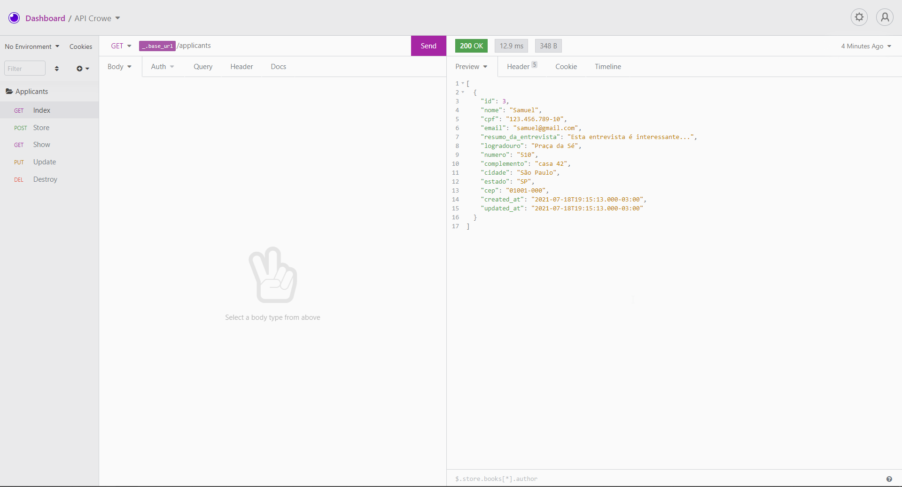

# crowe-api

[🇬🇧 - English](./README.en.md)

Desafio da Crowe para candidatos. API.

A Crowe está iniciando um novo processo seletivo e solicitou ao setor de Tecnologia a criação de um formulário para cadastrar os candidatos que participarem desse processo seletivo.

Este repositório guarda o back-end do projeto. Baixe e instale o projeto [crowe-web](https://github.com/samuel-s-marques/crowe-web) para ter a interface web.

<!--ts-->
- [crowe-api](#crowe-api)
	- [Features](#features)
	- [Tecnologias](#tecnologias)
	- [TODO](#todo)
	- [API](#api)
	- [Como usar](#como-usar)
		- [Pré requisitos](#pré-requisitos)
		- [Rodando o front-end (cliente)](#rodando-o-front-end-cliente)
		- [Rodando o back-end (servidor)](#rodando-o-back-end-servidor)
	- [Insomnia](#insomnia)
	- [Licença](#licença)
<!--te-->

## Features
- [ ] Cadastro de candidatos
- [ ] Listagem de candidatos
- [ ] Exclusão de candidatos
- [ ] Edição de candidatos

## Tecnologias
- [ ] [AdonisJS](https://adonisjs.com/)
- [ ] [Typescript](https://www.typescriptlang.org/)
- [ ] [SQLite3](https://www.sqlite.org/index.html)

## TODO
- [x] Cadastro
- [x] Listagem
- [x] Exclusão
- [x] Exibição
- [x] Edição
- [x] Paginação

## API
| Método | Rota | Handler | Descrição |
|--------|------|---------:|:-----------|
|  HEAD, GET  | /applicants | ApplicantsController.index | Lista todos os candidatos |
|  POST  | /applicants/new | ApplicantsController.store | Cria dados de um novo candidato |
|  HEAD, GET | /applicants/:id | ApplicantsController.show | Lista dados de um candidato específico, dado o ID |
|  PUT  | /applicants/:id | ApplicantsController.update | Atualiza dados de um candidato específico, dado o ID |
|  DELETE  | /applicants/:id | ApplicantsController.destroy | Apaga dados de um candidato específico, dado o ID |


## Como usar
Podemos considerar que este projeto está dividido em duas partes:
1. Front-end ([crowe-web](https://github.com/samuel-s-marques/crowe-web))
2. Back-end (este repositório)

O front-end precisa que o back-end esteja sendo executado para funcionar.

### Pré requisitos
Antes de começar, você vai precisar ter instalado em sua máquina o [Git](https://git-scm.com) e [Node.js](https://nodejs.org/en/).

### Rodando o front-end (cliente)

Baixe o repositório do front-end (necessário extrair os arquivos), seja clicando [aqui](https://github.com/samuel-s-marques/crowe-web/archive/refs/heads/master.zip) ou clonando com:

```bash
$ git clone https://github.com/samuel-s-marques/crowe-web
```

Acesse a pasta do projeto no terminal/cmd
```bash
$ cd crowe-web
```

Instale as dependências com **npm install**
```bash
$ npm install
```

Execute a aplicação em modo de desenvolvimento
```bash
$ npm run serve
```

### Rodando o back-end (servidor)

Baixe este repositório (necessário extrair os arquivos), seja clicando [aqui](https://github.com/samuel-s-marques/crowe-api/archive/refs/heads/master.zip) ou clonando com:

```bash
$ git clone https://github.com/samuel-s-marques/crowe-api
```

Acesse a pasta do projeto no terminal/cmd
```bash
$ cd crowe-api
```

Instale as dependências com **npm install**
```bash
$ npm install
```

Defina no arquivo .env.example as configurações. Para obter o valor da chave APP_KEY, você terá de gerar através do comando
```bash
$ node ace generate:key
```
Após gerar, copie o valor dado e cole na chave APP_KEY, do .env.example.
```cl
PORT=3333
HOST=0.0.0.0
NODE_ENV=development
APP_KEY=Cole aqui!
DB_CONNECTION=sqlite
```
E, então, remova o sufixo .example do arquivo.

Execute a aplicação em modo de desenvolvimento
```bash
$ npm run dev
```

O servidor iniciará na porta :3333.

## Insomnia
Caso queira testar a API, pode agilizar o processo pelo [Insomnia](https://insomnia.rest/).

<p align="center">
  
  <a href="Insomnia_API.json" target="_blank"></a>
</p>

## Licença
Esse projeto está sob a licença MIT. Veja o arquivo [LICENSE](LICENSE) para mais detalhes.